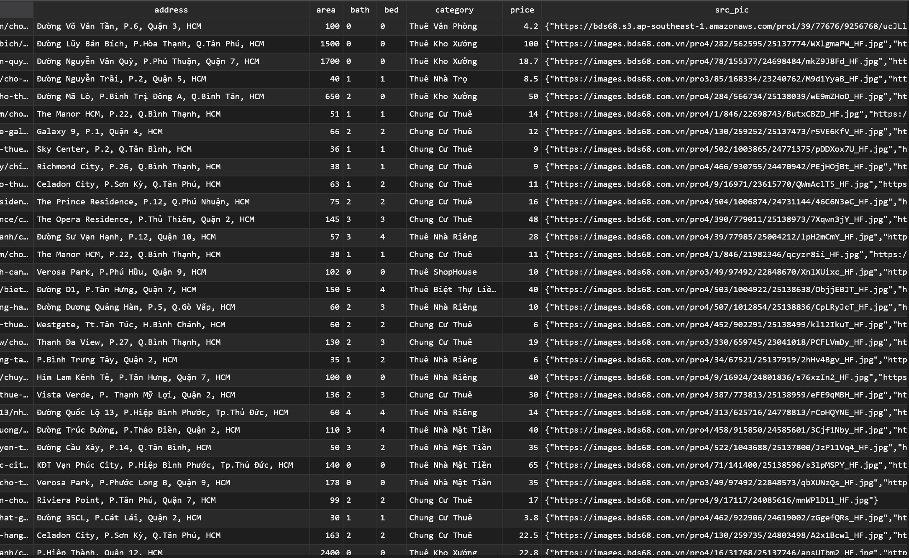
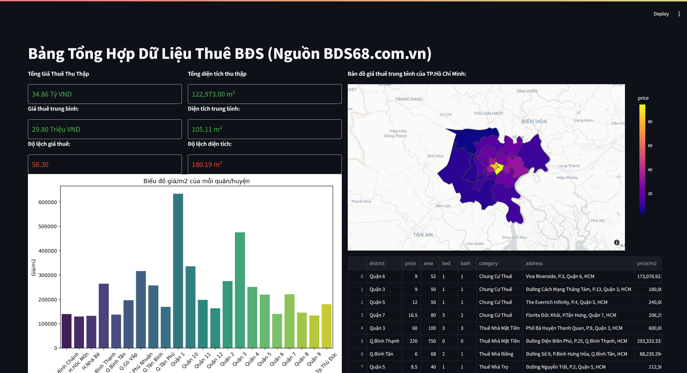
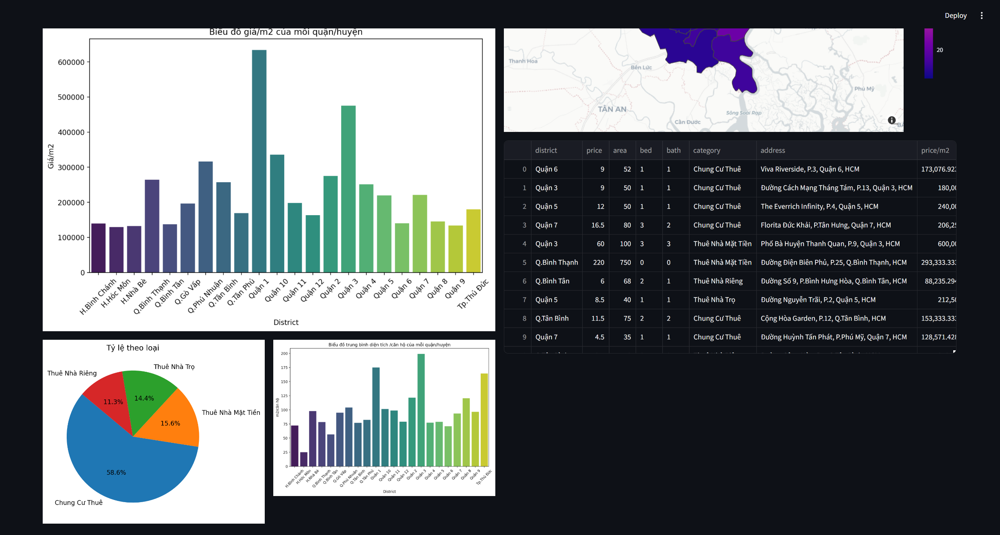

# Real-Time Rental Property Data Scraper for Ho Chi Minh City


This project aims to scrape real-time rental property data from Ho Chi Minh City using Playwright with Python, process and store the data using Kafka and Spark into a Cassandra database, and visualize the data using a Streamlit dashboard.

## Project Structure

- `scrap.py`: Script for scraping data from bds68.com.vn and sending it to Kafka.
- `jobs/spark_consumer.py`: Spark job for consuming data from Kafka, processing it, and storing it in Cassandra.
- `streamlit_app.py`: the Streamlit dashboard for data visualization.

## Getting Started

### Prerequisites

- Python 3.8+
- Apache Kafka
- Apache Spark
- Apache Cassandra
- Playwright
- Streamlit
  
### Steps to Run
1. Clone this repository.
2. Navigate to the root containing the Docker Compose file.
3. Run the following command:

```bash
docker-compose up -d
```

##### Additional Configuration
If you need to modify Zookeeper configurations or change the exposed port, you can update the `docker-compose.yml` file according to your requirements.

### Running the App
1. Install the required Python packages using the following command:

```bash
pip install -r requirements.txt
```

2. Scrapping data on bds68.com.vn:

```bash
python scrap.py
```

4. Consuming data from Kafka topic, enriching the data from Cassandra and producing data to specific topics on Kafka:

```bash
python ./spark_consumer.py
```

5. Running the Streamlit app:

```bash
streamlit run streamlit-app.py
```
## Screenshots
### Estate Infomation

### Dashboard


